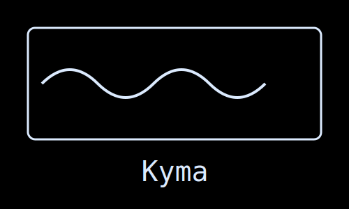
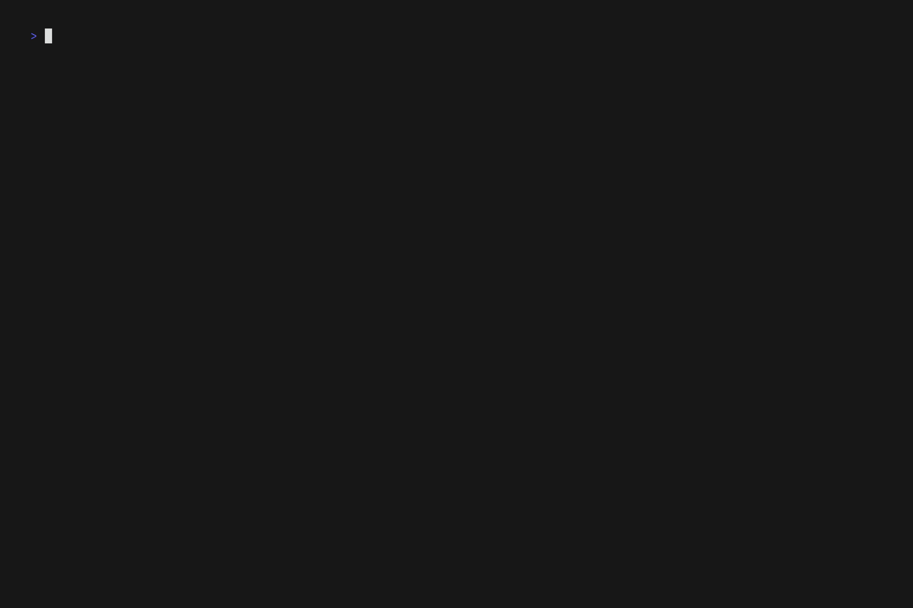

<div align="center">
  
</div>

&nbsp;

> **Κῦμα** (Kyma) - _Ancient Greek_: A wave, billow, or surge; metaphorically representing the flow and movement of ideas and presentations.

A terminal-based presentation tool that creates beautiful presentations from markdown files with smooth animated transitions.

<div align="center">
  
</div>

## Features

- **Markdown-based**: Write your presentations in simple markdown syntax
- **Rich rendering**: Beautiful terminal rendering using Glamour markdown renderer
- **Smooth transitions**: Multiple animated transition effects between slides
  - Swipe left/right
  - Slide up/down
  - Flip effects
- **Hot reload**: Live reloading of presentation files during editing with the `-w` flag
- **Customizable styling**: Configure borders, colors, and layouts via YAML front matter
- **Theme support**: Choose from built-in Glamour themes or load custom JSON theme files
- **Flexible layouts**: Center, align, and position content with various layout options
- **Simple navigation**: Intuitive keyboard controls for presentation flow (vim style btw)

## Installation

### Using Go

```bash
go install github.com/museslabs/kyma@latest
```

### From Source

```bash
git clone https://github.com/museslabs/kyma.git
cd kyma
go build -o kyma
```

## Usage

### Basic Usage

```bash
# Display a presentation
kyma presentation.md

# Watch for changes and auto-reload
kyma -w presentation.md

# Show version
kyma version
```

### Navigation

- **Next slide**: `→`, `l`, or `Space`
- **Previous slide**: `←` or `h`
- **Quit**: `q`, `Esc`, or `Ctrl+C`

## Configuration

Kyma presentations use a simple format with slides separated by `----` and optional YAML front matter for configuration.

### Presentation Format

```markdown
# First Slide
This is the content of the first slide

----
---
transition: swipeLeft
---

# Second Slide
This slide will appear with a swipe left transition

----
---
transition: slideUp
style:
  border: rounded
  border_color: "#9999CC"
  layout: center
  theme: dracula
---

# Third Slide
This slide has custom styling with Dracula theme

----
---
style:
  theme: /path/to/custom-theme.json
---

# Fourth Slide
This slide uses a custom JSON theme file
```

### Available Transitions

- `none` - No transition (default)
- `swipeLeft` - Slide swipes in from right to left
- `swipeRight` - Slide swipes in from left to right
- `slideUp` - Slide slides up from bottom
- `slideDown` - Slide slides down from top
- `flip` - Flip transition effect

### Style Configuration

You can customize each slide's appearance using the style configuration:

```yaml
style:
  border: rounded          # Border style: normal, rounded, double, thick, hidden, block
  border_color: "#FF0000"  # Hex color for border (or "default" for theme-based color)
  layout: center           # Layout positioning: center, left, right, top, bottom
  theme: dracula           # Theme name or path to custom JSON theme file
```

Layout can also be specified as a combination: `layout: center,right`

### Global Configuration

Kyma supports a global configuration file that can be used to set default styles and create named presets. The configuration file can be placed in either:

- The current directory as `kyma.yaml`
- The user's config directory as `~/.config/kyma.yaml`

You can also specify a custom config file path using the `-c` or `--config` flag:

```bash
kyma -c /path/to/config.yaml presentation.md
```

The configuration file follows this structure:

```yaml
global:
  style:
    border: rounded
    border_color: "#9999CC"
    layout: center
    theme: dracula

presets:
  minimal:
    style:
      border: hidden
      theme: notty
  dark:
    style:
      border: rounded
      theme: dracula
```

You can use presets in your slides by specifying the preset name:

```yaml
---
style:
  preset: minimal
---
# This slide uses the minimal preset
```

Configuration precedence (from highest to lowest):

1. Slide-specific configuration
2. Named preset configuration
3. Global configuration

### Theme Support

Kyma supports both built-in Glamour themes and custom JSON theme files:

#### Built-in Themes

- `ascii` - ASCII-only styling
- `auto` - Automatically detected theme
- `dark` - Dark theme (default)
- `dracula` - Dracula color scheme
- `tokyo-night` (or `tokyonight`) - Tokyo Night theme
- `light` - Light theme
- `notty` - Plain text styling
- `pink` - Pink color scheme

#### Custom JSON Themes

You can create custom themes by providing a path to a JSON file that follows the Glamour `StyleConfig` format. If the theme name doesn't match a built-in theme, Kyma will attempt to load it as a JSON file:

```yaml
style:
  theme: ./themes/my-custom-theme.json
```

The border color will automatically adapt to use the theme's H1 background color unless explicitly overridden with `border_color`.o

For more info on how to create custom styles, you can refer to [Glamour's](https://github.com/charmbracelet/glamour/tree/master/styles) documentation.

## Contributing

All contributions are welcome! If you're planning a significant change or you're unsure about an idea, please open an issue first so we can discuss it in detail.

### Development

1. Fork the repository
2. Create your feature branch (`git checkout -b feature/amazing-feature`)
3. Commit your changes (`git commit -m 'Add some amazing feature'`)
4. Push to the branch (`git push origin feature/amazing-feature`)
5. Open a Pull Request

## Acknowledgements

- [Charm](https://charm.sh/) for their amazing TUI libraries:
  - [Bubble Tea](https://github.com/charmbracelet/bubbletea) - Terminal UI framework
  - [Glamour](https://github.com/charmbracelet/glamour) - Markdown rendering
  - [Lipgloss](https://github.com/charmbracelet/lipgloss) - Style definitions
  - [Harmonica](https://github.com/charmbracelet/harmonica) - Smooth animations
- [Cobra](https://github.com/spf13/cobra) for CLI interface
- [fsnotify](https://github.com/fsnotify/fsnotify) for file watching capabilities

## Roadmap

- Add support for more style options like text color and background color
- ~~Allow choosing from any glamour themes~~ ✅ **Done!**
- ~~Support for custom JSON theme files~~ ✅ **Done!**
- Create grid-based slide layouts with transitions for each pane  
- Add more transition effects
- Support image rendering in terminals (e.g., via the Kitty protocol)
